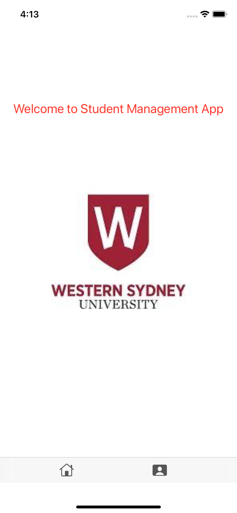
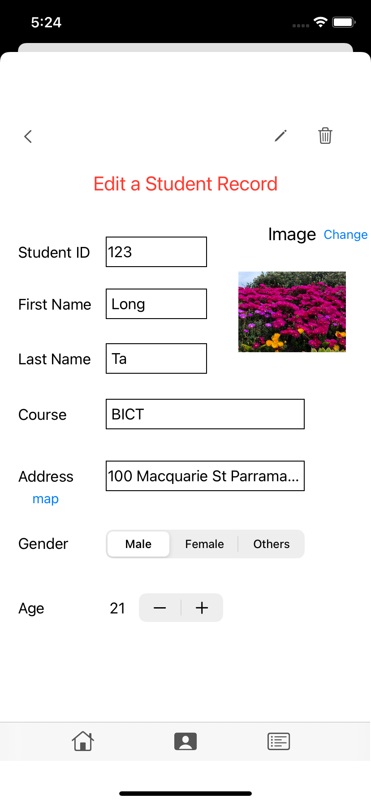
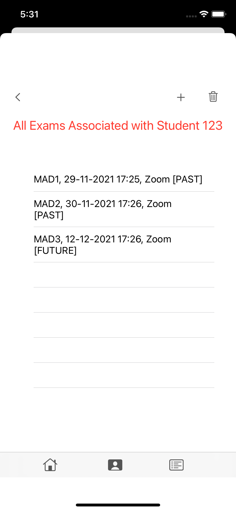

# Student Management XCode Swift App

A simple Student Management on an Xcode Swift App

## Table of Contents
1. [About the projects](#about-the-project)
2. [Technologies](#technologies)
3. [Features](#features)
4. [Setup](#setup)
5. [Contributing](#contributing)

## About the project
This project is a WSU Assignment that aims to build a Student Management on an XCode Swift App. Aside from the home screen, the App has three main functions allowing users to view and manipulate student records, and exams associated with each student.

## Technologies
* Swift
* Core Data

## Features
#### Student records
* Add a new student record
* Edit and delete a selected student record
* Assign one or more photo(s) from the camera photo gallery to a selected student record
* Show a student address included in the record on the map

#### Exams
* Add a new exam to the list
* View all the exam records associated with a student
* Delete multiple exams at the same time

## Setup
#### Prerequisites
* XCode

#### Installation
* Open Xcode
* Select Source Control > Clone
* Enter the link https://github.com/longta119/StudentManagement-iOSApp in the URL

## Contributing

Contributions are what make the open source community such an amazing place to learn, inspire, and create. Any contributions you make are **greatly appreciated**.

If you have a suggestion that would make this better, please fork the repo and create a pull request. You can also simply open an issue with the tag "enhancement".
Don't forget to give the project a star! Thanks again!

1. Fork the Project
2. Create your Feature Branch (`git checkout -b feature/AmazingFeature`)
3. Commit your Changes (`git commit -m 'Add some AmazingFeature'`)
4. Push to the Branch (`git push origin feature/AmazingFeature`)
5. Open a Pull Request
